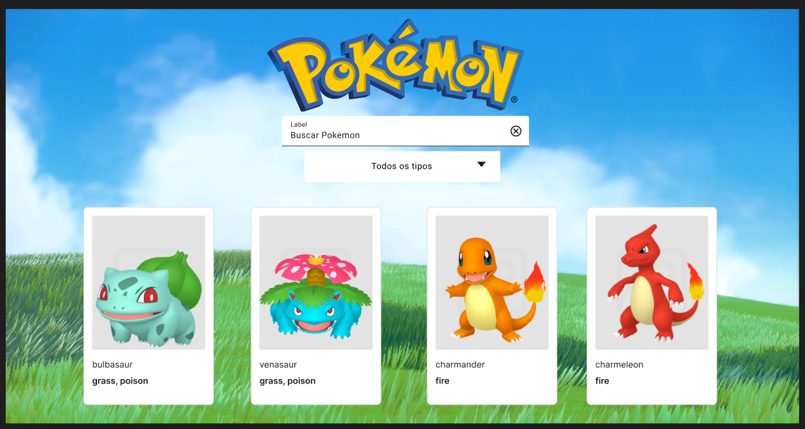

# Pokedex

## Descrição
Este projeto é uma Pokédex interativa que permite aos usuários buscar e visualizar informações sobre Pokémon. Utiliza HTML, CSS e JavaScript, integrando-se a uma API para obter dados dos Pokémon.

## Estrutura do Projeto
O projeto possui a seguinte estrutura de pastas e arquivos:


src/                  # Diretório principal do código-fonte
│
├── assets/           # Contém recursos estáticos
│   ├── icons/        # Ícones dos tipos dos Pokémon
│   └── images/       # Imagens de fundo e logo
│
├── css/              # Contém os estilos do projeto
│   ├── details/      # Estilos específicos da página de detalhes
│   │   ├── details.css        # Estilos da página de detalhes
│   │   └── typeIcons.css      # Estilo dos ícones de tipos de Pokémon
│   ├── header.css    # Estilos do cabeçalho
│   └── styles.css    # Estilos gerais do projeto
│
└── js/               # Contém os scripts JavaScript
    ├── card/         # Funções para criar cartas de Pokémon
    │   └── card.js
    ├── constants/    # Organização e acesso à URL da API e elementos HTML
    │   └── constants.js
    ├── details/      # Funções para exibir detalhes do Pokémon
    │   ├── details.js
    │   └── typeIcons.js    # Associa os Pokémon aos respectivos tipos
    └── fetchApi/     # Funções para buscar dados da API
        └── fetchfunctions.js
    └── main.js       # Lógica principal da aplicação


### Arquivos Principais
- **index.html**: Página inicial onde os usuários podem buscar Pokémon.
- **details.html**: Página que exibe detalhes específicos de um Pokémon selecionado.

## Instalação
Para executar o projeto localmente, siga os passos abaixo:

1. Clone o repositório:
   ```bash
   git clone https://github.com/bebshow2/guilherme-pokeapi.git

2. Navegue até o diretório do projeto:

cd guilherme-pokeapi

### Uso

1. **Na página inicial (`index.html`)**, digite o nome de um Pokémon no campo de busca.
2. **Os resultados** aparecerão abaixo.
3. **Use o filtro de tipo** para limitar a busca por tipos específicos de Pokémon.
4. **Clique em “Ver mais”** para ver mais detalhes sobre o Pokémon na página `details.html`.

### Tecnologias Utilizadas

- **HTML**
- **CSS (Bootstrap)**
- **JavaScript (ES6+)**

### Contribuição

Contribuições são bem-vindas! Sinta-se à vontade para abrir issues ou pull requests.


### Melhorias Feitas:
- Estrutura do projeto foi detalhada.
- Instruções de instalação foram adicionadas.
- A seção de uso agora inclui informações sobre o filtro de tipos.

Sinta-se à vontade para adaptar qualquer parte conforme suas preferências!


